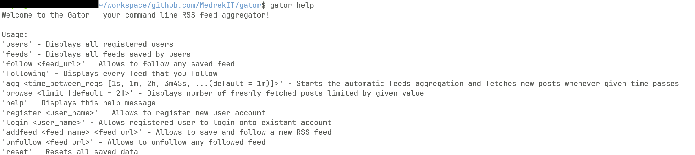

# Gator - RSS feed aggregator

Gator - RSS feed aggregator which allows you to follow to your favorite blogs and podcast if they are available in RSS.

---

## Table of Contents

- [Screenshots](#screenshots)
- [Motivation](#motivation)
- [Information](#information)
- [Installation](#installation)
- [Usage](#usage)
- [Contributing](#contributing)

---

## Screenshots




---

## Motivation

In modern entertainment and research you are pretty much always being controlled by "algorithms" they know the best what is good for you, and choose what you have to see, of course, you may find something valuable online, but the risk is that this mysterious algorithm will decide that is is not worth informing you about related news or posts, then you will probably forget what it was and that it exists.

You can prevent it by simply using an RSS aggregator, where YOU decide what is worth your time and what you want to read/listen about.

---

## Information

> [!NOTE]
> **Requirements:**
> - `go>=1.25.1`
> - `goose>=3.25.0`
> - `psql>=16.10`
> - `github.com/google/uuid>=1.6.0`
> - `github.com/lib/pq>=1.10.9`

> [!IMPORTANT]
> A config file called `.gatorconfig.json` is created in your `HOME_DIR` with preconfigured database URL. I hope it should be fine, but in case of problems or **if you change postgres password** you can change it in `gator/internal/config/config.go`, where it's named `dbUrl`.
> dbURL - `postgres://postgres:<HERE_SET_YOUR_PASSWORD>@localhost:5432/gator?sslmode=disable`
---

## Installation

```bash
curl -sS https://webi.sh/golang | sh # Install Go
git clone https://github.com/MedrekIT/gator.git # Clone repository
cd gator # Move to repository directory
go get github.com/google/uuid # Install 'google/uuid' package
go get github.com/lib/pq # Install 'lib/pq' package
go install github.com/pressly/goose/v3/cmd/goose@latest # Install goose
```
**Install psql**

macOS:
```bash
brew install postgresql@15
```
Linux (Debian/Ubuntu):
```bash
sudo apt update # Update dependencies
sudo apt install postgresql postgresql-contrib
sudo passwd postgres # Set postgres password (make sure you remember it and **provide into database URL**)
```
**Start the Postgres server and enter the psql shell**

macOS:
```bash
brew services start postgresql@15
psql postgres
```
Linux (Debian/Ubuntu):
```bash
sudo service postgresql start
sudo -u postgres psql
```
**Configure your database**

```SQL
CREATE DATABASE gator;
\c gator -- Connect to the new database
ALTER USER postgres PASSWORD 'postgres'; -- (Linux only) set the user password
exit
```

```bash
cd sql/schema/ # Go to database schema directory
goose postgres <YOUR_DB_URL> up # Migrate your database to the newest version
cd ../..
```

**Install program for global execution**
```bash
go install
```

---

## Usage

### Run
```bash
gator <command> [...args]
```

You are able to add some users (which you may treat as profiles/context groups), once you login, you may add any RSS feeds you'd like. Run `gator agg <time_interval>` in unused terminal, then try to browse your posts.

Here are some good blogs for you to start with your RSS adventure:
- `gator addfeed "Boot.dev Blog" https://blog.boot.dev/index.xml`
- `gator addfeed "Frontend Masters Blog" https://frontendmasters.com/blog/feed`

**Commands:**
- `gator help` - Displays all implemented commands
- `gator register <user_name>` - Allows to register new user account
- `gator login <user_name>` - Allows registered user to login onto existant account
- `gator users` - Displays all registered users
- `gator addfeed <feed_name> <feed_url>` - Allows to save and follow a new RSS feed
- `gator feeds` - Displays all feeds saved by users
- `gator follow <feed_url>` - Allows to follow any saved feed
- `gator unfollow <feed_url>` - Allows to unfollow any followed feed
- `gator following` - Displays every feed that you follow
- `gator agg <time_between_reqs [1s, 1m, 2h, 3m45s, ...]>` - Starts the automatic feeds aggregation and fetches new posts whenever given time passes
- `gator browse <limit [default = 2]>` - Displays number of freshly fetched posts limited by given value
- `gator reset` - Resets all saved data

---

## Contributing

### Install project

[Installation](#installation)

### Test if it works

```bash
gator help
```

### Submit a pull request

If you'd like to contribute, please fork the repository and open a pull request to the `main` branch.
